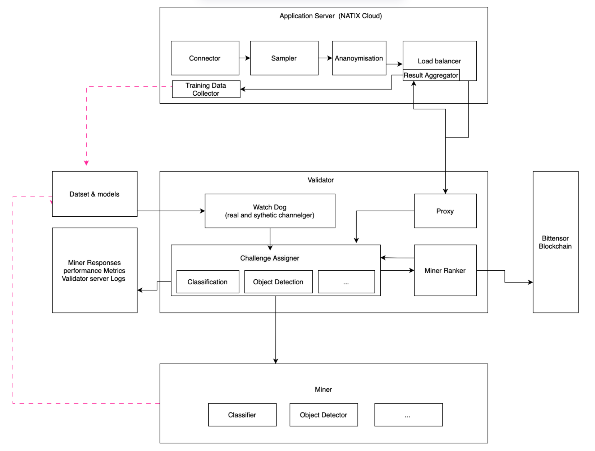

<p align="center">
  
</p>
<h1 align="center"> StreetVision  <br/> <small>Bittensor Subnet for Image Classification and Object Detection</small></h1>


This network is a decentralized subnet designed to inference images to extract information such as construction sites. Built on Bittensor, this subnet incentivizes miners to develop and deploy models that accurately detect features, starting with construction sites.

<table style="border: none !important; width: 100% !important; border-collapse: collapse !important; margin: 0 auto !important;">
  <tbody>
    <tr>
      <td><b>Docs</b></td>
      <td><b>Resources</b></td>
    </tr>
    <tr style="vertical-align: top !important">
      <td>
        ⛏️ <a href="docs/Mining.md">Mining Guide</a><br>
        🔧 <a href="docs/Validating.md">Validator Guide</a><br>
        🏗️ <a href="#subnet-architecture">Architecture Diagrams</a><br>
        📈 <a href="docs/Incentive.md">Incentive Mechanism</a><br>
        🤝 <a href="docs/Contributor_Guide.md">Contributor Guide</a></td>
      <td>
        🚀 <a href="https://www.natix.network">NATIX Network</a><br>
        🤗 <a href="https://huggingface.co/natix-network-org">NATIX Network Hugging Face</a><br>
        📊 <a href="https://wandb.ai/natix_network/natix-testnet">W&B</a><br>
      </td>
    </tr>
  </tbody>
</table>

## Core Components

> This documentation assumes basic familiarity with Bittensor concepts. For an introduction, please check out the docs: https://docs.bittensor.com/learn/bittensor-building-blocks.

**Miners**
- Miners are tasked with running binary classifiers that discern between images with and without roadwork, and are rewarded based on their accuracy.
- Miners predict a float value in [0., 1.], with values greater than 0.5 indicating the image contains roadwork.

A unique feature of the NATIX Network is its dynamic reward system. Miners must submit their image classification models to a public repository on Hugging Face. The submission is valid for 90 days, during which their reward factor is one. As time progresses beyond this period, the reward factor decays to zero, incentivizing continuous improvement and re-submission of models.

**Validators**
- Validators challenge miners with a balanced mix of real and synthetic media drawn from a diverse pool of sources.
- We continually add new datasets and generative models to our validators in order to maximize coverage of the types of diverse data. Models and datasets are defined in  `natix/validator/config.py`.


## Subnet Architecture



<details>
<summary align=center><i>Figure 1 (above): Ecosystem Overview</i></summary>
<br>

> This diagram provides an overview of the validator neuron, miner neuron, and other components external to the subnet.

- The green arrows show how applications interact with the subnet to provide construction site detection functionality.
- The blue arrows show how validators generate challenges, present miners with images, and score their responses.

</details>

## Community

For real-time discussions, community support, and regular updates, <a href="https://discord.gg/kKQR98CrUn">join our Discord server</a>. Connect with developers, researchers, and users to get the most out of Natix Subnet.

## License
This repository is licensed under the MIT License.
```text
# The MIT License (MIT)
# Copyright © 2025 NATIX Network

# Permission is hereby granted, free of charge, to any person obtaining a copy of this software and associated
# documentation files (the “Software”), to deal in the Software without restriction, including without limitation
# the rights to use, copy, modify, merge, publish, distribute, sublicense, and/or sell copies of the Software,
# and to permit persons to whom the Software is furnished to do so, subject to the following conditions:

# The above copyright notice and this permission notice shall be included in all copies or substantial portions of
# the Software.

# THE SOFTWARE IS PROVIDED “AS IS”, WITHOUT WARRANTY OF ANY KIND, EXPRESS OR IMPLIED, INCLUDING BUT NOT LIMITED TO
# THE WARRANTIES OF MERCHANTABILITY, FITNESS FOR A PARTICULAR PURPOSE AND NONINFRINGEMENT. IN NO EVENT SHALL
# THE AUTHORS OR COPYRIGHT HOLDERS BE LIABLE FOR ANY CLAIM, DAMAGES OR OTHER LIABILITY, WHETHER IN AN ACTION
# OF CONTRACT, TORT OR OTHERWISE, ARISING FROM, OUT OF OR IN CONNECTION WITH THE SOFTWARE OR THE USE OR OTHER
# DEALINGS IN THE SOFTWARE.
